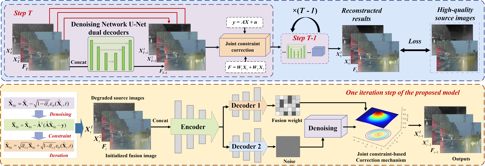

# Degradation-Robust-Fusion
🔥 [CVPR 2026] Official code for "Degradation-Robust Fusion: An Efficient Degradation-Aware Diffusion Framework for Multimodal Image Fusion in Arbitrary Degradation Scenarios"
> **Institutions:** Hefei University of Technology, Kunming University of Science and Technology, University of Science and Technology of China.
>---

## 📢 News
* **[2026.02]** Our paper has been accepted by **CVPR 2026**! 🎉
* **[2026.03]** Training and testing codes are officially released.

--- 
## 📖 Abstract
*(Complex degradations like noise, blur, and low resolution are typical challenges in real-world image fusion tasks, limiting the performance and practicality of existing methods. End-to-end neural network–based approaches are generally simple to design and highly efficient in inference, but their black-box nature leads to limited interpretability. Diffusion-based methods alleviate this to some extent by providing powerful generative priors and a more structured inference process. However, they are trained to learn a single-domain target distribution, whereas fusion lacks natural fused data and relies on modeling complementary information from multiple sources, making diffusion hard to apply directly in practice. To address these challenges, this paper proposes an efficient degradation-aware diffusion framework for image fusion under arbitrary degradation scenarios. Specifically, instead of explicitly predicting noise as in conventional diffusion models, our method performs implicit denoising by directly regressing the fused image, enabling flexible adaptation to diverse fusion tasks under complex degradations with limited steps. Moreover, we design a joint observation model correction mechanism that simultaneously imposes degradation and fusion constraints during sampling to ensure high reconstruction accuracy. Experiments on diverse fusion tasks and degradation configurations demonstrate the superiority of the proposed method under complex degradation scenarios.)*
<p align="center">
  
</p>
<p align="center">
  <em>Figure 1: The overall architecture of our proposed Degradation-Robust Fusion framework.</em>
</p>

## Create a virtual environment and install dependencies
```bash
conda create -n DRFusion python=3.9 -y
conda activate DRFusion
```

### Recommended Environment
 * python = 3.8.20
 * torch = 2.3.1
 * torchvision = 0.18.1
 * cuda = 12.8
 * numpy = 1.24.3
 * scipy = 1.10.1
 * opencv-python = 4.12.0.88

## 📂 Dataset Preparation
Please place the training and testing datasets in the data/ folder following the structure below:
```text
Degradation-Robust-Fusion/
└── data/M3FD
    ├── train/
    │   ├── ir/
    │   └── vi/
    └── test/
        ├── ir/
        └── vi/
```

## 🚀 Quick Start
Testing
You can quickly evaluate our model using the provided bash script. Pre-trained weights [Google Drive](https://drive.google.com/drive/folders/1o6V0B5PlzQx_qWijsK_R5SsghbnSAfuI?usp=sharing) should be placed in the weight/ directory.
```
python test.py
```
Training
To train the framework, simply run:
```
python train.py
```
